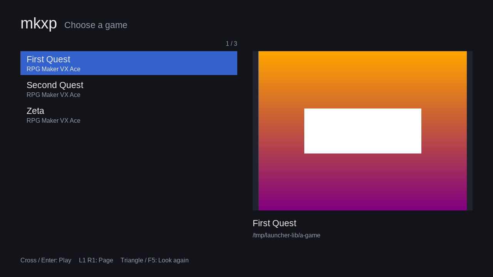

# mkxp for the PlayStation 5

This directory cross-compiles mkxp for the PS5 with the
[ps5-payload-dev SDK](https://github.com/ps5-payload-dev/sdk). The PS5 runs a
modified FreeBSD kernel on x86_64, and the SDK targets it as
`x86_64-sie-ps5` with Clang 18. The whole toolchain runs in a Docker image,
and every upstream revision is pinned, so a rebuild on another machine
produces the same toolchain.

There are two ways to run mkxp on the console. The build produces both:

| | **Payload** (`mkxp.elf`) | **Native title** (`PPSA77001/`) |
|---|---|---|
| Rendering | Software OpenGL (Mesa llvmpipe through OSMesa) | **GPU** OpenGL through [ps5-opengl](https://github.com/blackbearreloaded/ps5-opengl) (Mesa on the PS5's AGC driver) |
| Launch | Send to an ELF loader such as [elfldr](https://github.com/ps5-payload-dev/elfldr) | Install the folder as a title, e.g. with [ShadowMountPlus](https://github.com/drakmor/ShadowMountPlus) and start it from the home screen |
| Choosing a game | `gameFolder=` in `mkxp.conf` | Built-in game launcher: copy game folders to `/data/mkxp/games/` (or a USB drive) and pick one with the controller |
| Games | RPG Maker XP, VX, VX Ace | RPG Maker XP, VX, VX Ace, and **MV and MZ** through [Outsider](#rpg-maker-mv-and-mz-games) |

## Quick start

Requirements: Docker (BuildKit), about 25 GB of free disk space and an
internet connection. The first run builds the toolchain image. This takes
roughly an hour on 4 cores, and most of that is LLVM and Mesa for the payload.
Later runs reuse the cached image and only rebuild mkxp.

```console
$ ./ps5/build.sh                              # or, with more cores:
$ ./ps5/build.sh --build-arg MAKEFLAGS=-j16
$ TARGET=native ./ps5/build.sh                # only one of the two
```

Output in `ps5/out/`:

| File | Purpose |
|------|---------|
| `mkxp.elf` | The payload (statically links everything except PS5 system libraries) |
| `libOSMesa.so.8` | Software OpenGL for the payload, loaded at runtime |
| `PPSA77001/` | The native title folder: `eboot.bin`, `sce_module/libc.prx`, `sce_sys/`, `outsider/shims/` |
| `mkxp.conf.sample` | Configuration template |

Any arguments to `build.sh` are passed to `docker build`. The script then runs
`scripts/build-mkxp.sh` in the image, with the repository mounted at `/src`.
Environment variables for `build.sh`:

| Variable | Default | Meaning |
|----------|---------|---------|
| `TARGET` | `all` | `payload`, `native` or `all` |
| `MKXP_TITLE_ID` | `PPSA77001` | Title ID of the native title. Only matters if you install more than one copy, e.g. single-game titles |
| `MKXP_TITLE_NAME` | `mkxp` | Name on the home screen |
| `MKXP_SCE_SYS` | | A directory inside this repository with replacement `icon0.png` (512×512), `pic0.dds`, `pic1.dds` and `snd0.at9` |

## What gets built

`Dockerfile` has five expensive layers. Each one is cached on its own:

1. **SDK and libraries from [pacbrew-repo](https://github.com/ps5-payload-dev/pacbrew-repo)**
   (`scripts/build-pacbrew.sh`, using upstream's PKGBUILDs through `makepkg`):
   the SDK, libc++, zlib, bzip2, libpng, libjpeg-turbo, libwebp, freetype,
   libogg, libvorbis, libsamplerate, SDL2 (the
   [PS5 port](https://github.com/ps5-payload-dev/SDL)), SDL2_image, SDL2_ttf
   and OpenAL Soft.
2. **LLVM and Mesa** (also from pacbrew-repo), for the payload only. The PS5
   SDL port gets OpenGL by `dlopen()`ing `libOSMesa.so.8`, which renders in
   software with llvmpipe. See `WITH_MESA` below.
3. **mkxp dependencies that pacbrew lacks** (`scripts/build-deps.sh`):

   | Component | Version | Notes |
   |-----------|---------|-------|
   | libps5compat | in-tree (`compat/`) | `execl`, `execle` and `endpwent`, which the SDK's libc lacks and Ruby needs |
   | libsigc++ | 2.12.1 | |
   | pixman | 0.42.2 | |
   | PhysFS | 3.2.0 | |
   | Boost | 1.86.0 | `unordered` headers, `program_options` |
   | SDL_sound | [Ancurio's fork](https://github.com/Ancurio/SDL_sound) @ `04798ba` | WAV, VOC, AIFF, AU, RAW, SHN, Ogg |
   | Ruby (MRI) | 3.1.7 | static, no stdlib extensions, `Zlib` compiled into the core like in RGSS (`patches/ruby-3.1-ps5.patch`) |

4. **Native title toolchain** (`native/setup-native.sh`), for the native title only:

   | Component | Version | Notes |
   |-----------|---------|-------|
   | [ps5-opengl](https://github.com/blackbearreloaded/ps5-opengl) SDK | 1.0.1 (release archive, sha256-pinned) | OpenGL 4.6 / EGL on the GPU, statically linked |
   | [ps5-native-app-boilerplate](https://github.com/blackbearreloaded/ps5-native-app-boilerplate) | `4f531c4`, the revision ps5-opengl 1.0.1 pins | FSELF converter and signer, startup code, and the clean-room `libc.prx` loader module (verified against its published hash) |
   | SDL2 with ps5-opengl's EGL video driver | ps5-payload-dev/SDL `8c56053`, as ps5-opengl's `integration/SDL2` builds it | With two changes: SDL audio stays enabled (upstream's bridge turns it off; mkxp's OpenAL plays through it), and `native/sdl-g19-render-thread.patch` lets the GL context live on mkxp's render thread |

5. **RPG Maker MV/MZ runtime** (`outsider/build-outsider.sh`), for the native title only. See
   [RPG Maker MV and MZ games](#rpg-maker-mv-and-mz-games):

   | Component | Version | Notes |
   |-----------|---------|-------|
   | [Outsider](https://github.com/General-Arcade/outsider) | `f789f46` | GPL-3.0-or-later (or commercial) |
   | [Tsukuru Player](https://github.com/tragicdiscordly-spec/tsukuru-player)'s PS5 port of it | `9cdcf19`, `patches/outsider/0001-ps5-port.patch` (sha256-pinned) | SDL2 platform layer, DualSense touchpad as mouse, MV compatibility shims. GPL-3.0-or-later |
   | `outsider/outsider-mkxp.patch` | in-tree | GPU OpenGL through ps5-opengl, `outsider_main()` in place of `main()`, `window.close()` quits like NW.js |
   | QuickJS-NG | `2f0aa72` (v0.17.0+3), the revision Tsukuru Player uses | |
   | SoLoud | `e82fd32` | |

Pinned upstream revisions, set as `ARG`s in the `Dockerfile`:

| ARG | Repository |
|-----|------------|
| `PS5_SDK_COMMIT` | ps5-payload-dev/sdk |
| `PS5_PACBREW_COMMIT` | ps5-payload-dev/pacbrew-repo (fixes the versions of every pacbrew package) |
| `PS5_SDL_COMMIT` | ps5-payload-dev/SDL (the payload's SDL) |

The native toolchain's revisions are pinned at the top of
`native/setup-native.sh`, Outsider's at the top of `outsider/build-outsider.sh`. Tarballs are verified by sha256 (in the PKGBUILDs,
`build-deps.sh` or `setup-native.sh`). Git checkouts and archives are verified
by commit hash.

### Build arguments

| Argument | Default | Meaning |
|----------|---------|---------|
| `MAKEFLAGS` | `-j4` | Parallelism for the toolchain build |
| `WITH_MESA` | `1` | `0` skips LLVM and Mesa, which saves most of the build time. The payload then needs a `libOSMesa.so.8` from another source on the console. The native title doesn't need it |
| `WITH_NATIVE` | `1` | `0` skips the native title toolchain |
| `WITH_OUTSIDER` | `1` | `0` builds the native title without the RPG Maker MV/MZ runtime |
| `BASE_IMAGE` | `ubuntu:24.04` | Override this to use a derived image, e.g. one that trusts a corporate proxy CA |
| `PS5_*_COMMIT` | see above | Bump these deliberately to update the toolchain |

### Offline or mirrored sources

Any file placed in `ps5/sources/` is copied into the image as makepkg's
`SRCDEST` and as the download cache of `build-deps.sh` and `setup-native.sh`.
Files are still checked against their pinned sha256, so a file from a mirror
works only if it is identical to the upstream one. Missing files are
downloaded as usual. File names must match what would be downloaded, which is
usually the basename of the URL, e.g. `v0.8.6.tar.gz` for openlibm.

## How the native title is built

mkxp is compiled with the same toolchain and libraries as the payload, with
`-DPS5_NATIVE=ON` and SDL resolved to the ps5-opengl build
(`native/native-pkg-config`). Only the final link differs.
`native/native-link.sh` takes CMake's place as the linker. It puts mkxp's
objects and libraries, the ps5-opengl runtime, libc++ and the payload SDK's
libc into one linker group. It then runs the boilerplate's builder, the same
way ps5-opengl's `integration/SDL2/folder.py` does: link with the native
startup code and ps5-opengl's allocator (`app_heap.c`), convert to an FSELF
`eboot.bin`, and assemble the title folder. The title metadata starts from
ps5-opengl's `native-app/param.json`, which sets the GPU memory budgets.
`native/mkxp_native.c` sends mkxp's output to `/download0/mkxp.log`, raises the
allocator's budget to 1 GiB (it falls back to less if the mapping fails), and
stubs one symbol the GL runtime expects.

ps5-opengl 1.0.1's SDL driver creates OpenGL 3.3 *core* profile contexts. That
is also the configuration it has a conformance run for. mkxp's shaders are
written in GLSL 1.10, so on core profile contexts mkxp now compiles them as
GLSL 3.30 through a small preamble (`src/shader.cpp`). The rest of its GL code
already avoided removed functionality.

## Working in the image by hand

```console
$ docker run --rm -it -v "$PWD:/src" --user "$(id -u):$(id -g)" mkxp-ps5-dev bash
$ /src/ps5/scripts/build-mkxp.sh native      # same as build.sh's last step
$ source $PS5_PAYLOAD_SDK/toolchain/prospero.sh
$ $CMAKE --build /src/ps5/build/payload      # incremental rebuild
```

`build-deps.sh` also takes component names, e.g. `build-deps.sh ruby`. This
helps when you change one dependency in a derived image.

## Testing without a console

`tests/gl-smoke.sh` builds mkxp for Linux in Docker and runs a generated
RGSS3 test game (`tests/gl-smoke/main.rb`) on Mesa llvmpipe under Xvfb, once
with a compatibility context and once with the 3.3 core context the native
title requests. The game draws sprites through mkxp's sprite, hue, text and
transition paths, reads the frame back and compares pixels against
`tests/gl-smoke/expected.txt`:

A third run checks the game launcher on the core profile build
(`tests/gl-smoke/launcher-test.sh`). It puts three copies of the test game in
a library, presses Down and Enter with `xdotool`, and checks that the second
game ran from its own folder.

The core profile build has Outsider linked in, built by the same
`outsider/build-outsider.sh` as for the console (with the host's SDL2). A
fourth run (`tests/mv-smoke/`) generates an RPG Maker MV game from the MV
engine scripts, which KADOKAWA published under the MIT license
([rpgtkoolmv/corescript](https://github.com/rpgtkoolmv/corescript)), and a
test plugin. It packages the game NW.js style in `www/`, starts it from the
launcher, and checks the game's bitmaps and a screenshot of what Outsider drew.

To keep the screenshots, mount a directory at `/tmp/shots`:

```console
$ ./ps5/tests/gl-smoke.sh -v "$PWD/shots:/tmp/shots"
==> compat profile
GL Version   : 4.5 (Compatibility Profile) Mesa 25.2.8
PASS
==> core profile
GL Version   : 4.5 (Core Profile) Mesa 25.2.8
PASS
==> launcher (core profile)
Launcher: found 3 games
GL Version   : 4.5 (Core Profile) Mesa 25.2.8
PASS
==> RPG Maker MV game on Outsider (core profile)
Launcher: found 1 games
Starting Outsider for /tmp/mv-lib/MV Smoke/www
script_loader: RPG Maker MV game
[GL] Version: 4.5 (Core Profile) Mesa 25.2.8
PASS
```

## Running the payload

You need a PS5 that runs an ELF loader such as
[elfldr](https://github.com/ps5-payload-dev/elfldr), which listens on port
9021.

1. Copy `libOSMesa.so.8` to `/user/homebrew/lib/` on the console, e.g. with
   ftpsrv. The payload loader also searches the working directory, so a copy
   next to the game works too.
2. Copy the game (the folder with `Game.ini`), `mkxp.conf` and optionally
   `mkxp.elf` to the console, e.g. the game to `/data/mkxp/games/MyGame/` and
   the rest to `/data/mkxp/`.
3. mkxp switches to the directory of its own executable before it reads
   `mkxp.conf`. If the loader does not pass a path in `argv[0]` (for example,
   when the ELF is sent straight to port 9021), the PS5 SDL port reports
   `/data/` instead. In that case, put a `mkxp.conf` in `/data/` that points
   at the game:

   ```ini
   gameFolder=/data/mkxp/games/MyGame
   ```

4. Send the payload:

   ```console
   $ docker run --rm --network host -v "$PWD/ps5/out:/out" mkxp-ps5-dev \
         /opt/ps5-payload-sdk/bin/prospero-deploy -h <ps5-ip> /out/mkxp.elf
   ```

   (`socat -t 99999999 - TCP:<ps5-ip>:9021 < ps5/out/mkxp.elf` also works.)

## Running the native title

Install the title once, then add games by copying folders. No rebuild is
needed.

1. Upload the whole `ps5/out/PPSA77001/` folder to `/data/homebrew/` on the
   console, e.g. with ftpsrv, and register it with a compatible loader such as
   ShadowMountPlus. `eboot.bin` can't be deployed by itself.
2. Copy each game's folder (the one containing `Game.ini`, `Data/`,
   `Graphics/`, …) into a game library:

   | Library | |
   |---------|---|
   | `/data/mkxp/games/` | Internal storage. The title creates this folder the first time it starts |
   | `/mnt/usb0/mkxp/games/`, `/mnt/usb1/mkxp/games/` | USB drives |
   | `/app0/games/` | Games bundled inside the title folder (`PPSA77001/games/`) |

   For example `/data/mkxp/games/MyGame/Game.ini`. A folder that holds just one
   subfolder with the game (`MyGame/MyGame/Game.ini`, as archives often
   extract) is found as well. RPG Maker MV and MZ games go in the same
   places (see [below](#rpg-maker-mv-and-mz-games)).
3. Start **mkxp** from the home screen. The launcher lists every game it
   found, sorted by title, with the RPG Maker version and the game's title
   screen as a preview:

   

   | DualSense | Keyboard | |
   |-----------|----------|---|
   | D-pad, left stick | ↑ ↓ | Select (hold to scroll) |
   | L1 / R1 | Page Up / Down | Scroll a page |
   | Cross | Enter | Play |
   | Triangle | F5 | Look for games again, e.g. after copying more over FTP |

The launcher starts on the game played last. Choosing a game starts mkxp's
engine with it. Quitting the game closes the title. Start it again to pick
another game: Ruby can only be started once per process.

**Saves.** A game saves into its own folder when that folder is writable,
as `/data` and USB drives are. That way saves sit next to the game and can be
backed up together. Games in the read-only title folder (`/app0/games/`) save
to `/download0/<folder name>/` instead. The log is always
`/download0/mkxp.log`.

**Configuration.** A `mkxp.conf` in the title folder applies to all games,
e.g. `smoothScaling=false` or an `RTP=` path. A `mkxp.conf` in a game's folder
overrides it for that game. Use absolute paths for `RTP=` and `midi.soundFont`
in the title's `mkxp.conf`. `gameLibrary=` replaces the list of libraries and
can be given several times. Libraries under `/data` are created if they're missing:

```ini
gameLibrary=/data/rpg
gameLibrary=/mnt/usb0/rpg
```

**Single-game titles.** If the title folder itself holds a game (a `Game.ini`
next to `eboot.bin`), or its `mkxp.conf` sets `gameFolder=`, mkxp starts that
game directly, without the launcher. To install games as separate home-screen
tiles, build one title per game with its own `MKXP_TITLE_ID` and
`MKXP_TITLE_NAME`, and copy the game into it. In this mode saves go to
`/download0`, and separate title IDs keep them apart.

The launcher also works in other builds, payload and desktop included, when
`mkxp.conf` sets `gameLibrary=` and the working directory holds no game.

## RPG Maker MV and MZ games

MV and MZ games aren't RGSS games: they are JavaScript and HTML5, made for a
browser engine (NW.js). The native title runs them with
[Outsider](https://github.com/General-Arcade/outsider), a native MV/MZ
runtime: the game's own JavaScript runs in QuickJS-NG, with stand-ins for the
browser and Node.js APIs it uses (DOM, canvas, PIXI, Web Audio, `fs`, …), and
rendering goes through OpenGL. The PS5 port of Outsider comes from
[Tsukuru Player](https://github.com/tragicdiscordly-spec/tsukuru-player),
which runs it as a payload on Mesa's software renderer. Here it is linked into
the native title, so it draws on the GPU through ps5-opengl like mkxp does.

Copy MV and MZ games into the same game libraries. The launcher recognizes a
game folder with `js/main.js` and `js/rpg_core.js` (MV) or `js/rmmz_core.js`
(MZ), or one with a `www/` folder holding those, as games packaged with NW.js
have. A Steam copy's folder can be copied as it is. The launcher takes the
title from `data/System.json` and the preview from `img/titles1/` (unless the
game's pictures are encrypted). Choosing such a game hands the console over to
Outsider: mkxp's launcher closes its window and calls `outsider_main()` with
the game's folder and the shims in `PPSA77001/outsider/shims/`.

- **Saves** go where the game puts them, normally `www/save/` in the game's
  folder. Keep MV/MZ games on `/data` or a USB drive. Games in the read-only
  title folder can't save.
- **Log:** Outsider writes `debug.log` into the game's folder. Its other
  output (script errors, crash reports) goes to mkxp's log,
  `/download0/mkxp.log`.
- **Controls:** the DualSense works like a gamepad in NW.js. The touchpad
  moves a pointer, and a tap clicks (two fingers: right click, which cancels in
  MV/MZ).
- **Quitting** the game (e.g. "Quit Game" on the title screen) closes the
  title, as with RGSS games.
- **Audio and video:** Ogg and WAV play. M4A audio has to be converted to Ogg
  and movies to MPEG-1 first, as Outsider's own releases require. Tsukuru
  Player's README describes how.
- **Compatibility:** Outsider's MV support, and the plugin workarounds in
  Tsukuru Player's port, decide which games work. Tsukuru Player reports that
  most games it tried play. Its patch mentions Fear & Hunger 2 among the games
  it fixed, and that work is included here. Games that need Steam, other
  Windows programs, or the internet, or that protect their files in their own
  way, may not work.

## Display and controls

The window always covers the whole 1920×1080 display. The payload's video
driver centers smaller windows instead of scaling them, and the native title's
driver only accepts the display size. mkxp scales the game itself, so set
`fixedAspectRatio` and `smoothScaling` in `mkxp.conf` to taste. Keep
`winResizable` off. The native title's driver rejects resizable windows.

Default DualSense mapping. To change it, edit `src/keybindings.cpp`, or plug
in a USB keyboard and use mkxp's F1 menu:

| DualSense | RGSS button |
|-----------|-------------|
| Cross     | C (confirm) |
| Circle, Options | B (cancel / menu) |
| Square    | A |
| Triangle  | X |
| L1 / R1   | L / R |
| L2 / R2   | Y / Z |
| D-pad, left stick | directions |

## Changes to mkxp for this port

- `CMakeLists.txt`: name the binary `mkxp.elf` when built with the PS5
  toolchain. Add a stand-in for the SDL2 target that the static OpenAL Soft
  package references. Add the `PS5_NATIVE` option (defines `MKXP_PS5_NATIVE`).
- `src/main.cpp` on `__PROSPERO__`: create the window at desktop size, and call
  `SDL_SetMainReady`.
- `src/keybindings.cpp`: DualSense default bindings on `__PROSPERO__`.
- With `MKXP_PS5_NATIVE`: request an OpenGL 3.3 core context. Start in `/app0`.
  Default to the game libraries above. Mount the game folder by absolute
  path, then switch to `/download0` (or the launcher's save folder) for
  Ruby's file I/O (`src/main.cpp`, `src/config.cpp`, `src/sharedstate.cpp`).
- Game launcher (`src/launcher.cpp`, any platform): runs before the engine
  when there is no game to start, on the GL context that the RGSS thread then
  takes over. It draws into an SDL surface with SDL_ttf and the bundled
  Liberation Sans, and shows it as one textured quad, so it needs nothing from
  the engine's renderer. `Config::read` can layer several `mkxp.conf` files,
  with a new `gameLibrary` setting and an internal `saveFolder`.
- Outsider (`CMakeLists.txt` option `OUTSIDER_OBJECT`, `src/main.cpp`,
  `src/launcher.cpp`): when linked in, the launcher lists MV/MZ games and
  hands them to `outsider_main()`. `outsider/build-outsider.sh` builds
  Outsider, SoLoud and QuickJS-NG into one relocatable object that defines
  nothing but `outsider_main()`. Everything else is made local, so none of their
  symbols can clash with mkxp's libraries.
- Fixes that help any modern toolchain:
  - `binding-mri.cpp`: since Ruby 2.7, parts of the core library
    (`Kernel#class`, `Marshal.load`, …) are Ruby code that is only loaded
    during option processing. mkxp only called `ruby_setup()`, so with Ruby
    ≥ 2.7, loading the game's scripts crashed. It now also runs
    `ruby_options()` on an empty script.
  - `binding-util.h`: Ruby version checks that also hold for Ruby 3.x, and an
    `rb_data_type_t` initializer that stays valid since Ruby 2.7 changed the
    struct.
  - `shader.cpp`, `gl-fun.cpp`: run the GLSL 1.10 shaders on core profile
    contexts.
  - `eventthread.cpp`: no duplicate `ALC_SOFT_pause_device` typedefs with new
    OpenAL Soft headers.
  - `fluid-fun.cpp`: recognize FreeBSD.

## Known limitations

- **Neither variant has been run on a console yet.** The builds are verified to
  produce a payload that links only against PS5 system libraries, and a title
  folder whose FSELF and `libc.prx` pass the boilerplate's integrity checks.
  The native title also passes the generic checks of ps5-opengl's
  `verify-native-test-app.sh`: segment alignment, allocator wraps, AGC/VideoOut
  imports, no forbidden unresolved symbols. The core profile rendering path is
  verified on Mesa llvmpipe (`tests/gl-smoke.sh`), but not on the PS5 GPU.
  The same goes for the launcher, including the paths it scans and whether a
  native title may read and write `/data` and `/mnt/usb*`. Homebrew installed
  with ShadowMountPlus normally can.
- Native title specifics that are outside what ps5-opengl has validated:
  - SDL audio in the native title.
  - Rendering from a thread other than the one that initialized video.
  - A 1 GiB allocator budget.
  - Using the payload SDK's libc for functions the native libc lacks.
- The payload renders in software (llvmpipe). RGSS resolutions are small, but
  expect it to be slower than on a PC.
- No MIDI: mkxp would `dlopen()` fluidsynth, and no PS5 build of it is
  bundled. No MP3: SDL_sound is built without mpg123.
- Outsider in the native title is new territory on top of that:
  - It has been built, linked, and tested on Linux with Mesa, but not run on a console.
  - It hands over from mkxp by shutting SDL down and letting Outsider start it
    again on its own thread, with a 128 MB stack.
  - ps5-opengl's SDL driver asks for a 3.3 core context. Outsider needs
    OpenGL 4.5. Mesa returns its newest core version for such a request, as it
    does on llvmpipe in the tests, and ps5-opengl implements 4.6. Neither
    has been checked on the PS5.
  - It shares the 1 GiB allocator budget (see
    [How the native title is built](#how-the-native-title-is-built)). Big MV
    games may need more. Raise `ps5_opengl_heap_size` in
    `native/mkxp_native.c` if a game runs out.
- Tsukuru Player notes that on firmware 13.60, programs started through
  websrv can't open relative paths. Native titles start differently, and
  mkxp, which uses relative paths after `chdir()`, hasn't been tried on a
  console. If the log shows files not being found, this is the first thing to
  check. Tsukuru Player's `shim/ps5path.c` works around it.
- The launcher shows titles in Liberation Sans, which has no CJK glyphs.
  Japanese titles in UTF-8 show as boxes. Titles that aren't UTF-8 (e.g.
  Shift-JIS) fall back to the folder name.
- Ruby is 3.1, not the 1.8/1.9 that RPG Maker used, and has no stdlib
  extensions. Scripts that rely on old syntax or on `require` of stdlib
  libraries need changes, as on any modern mkxp build.
